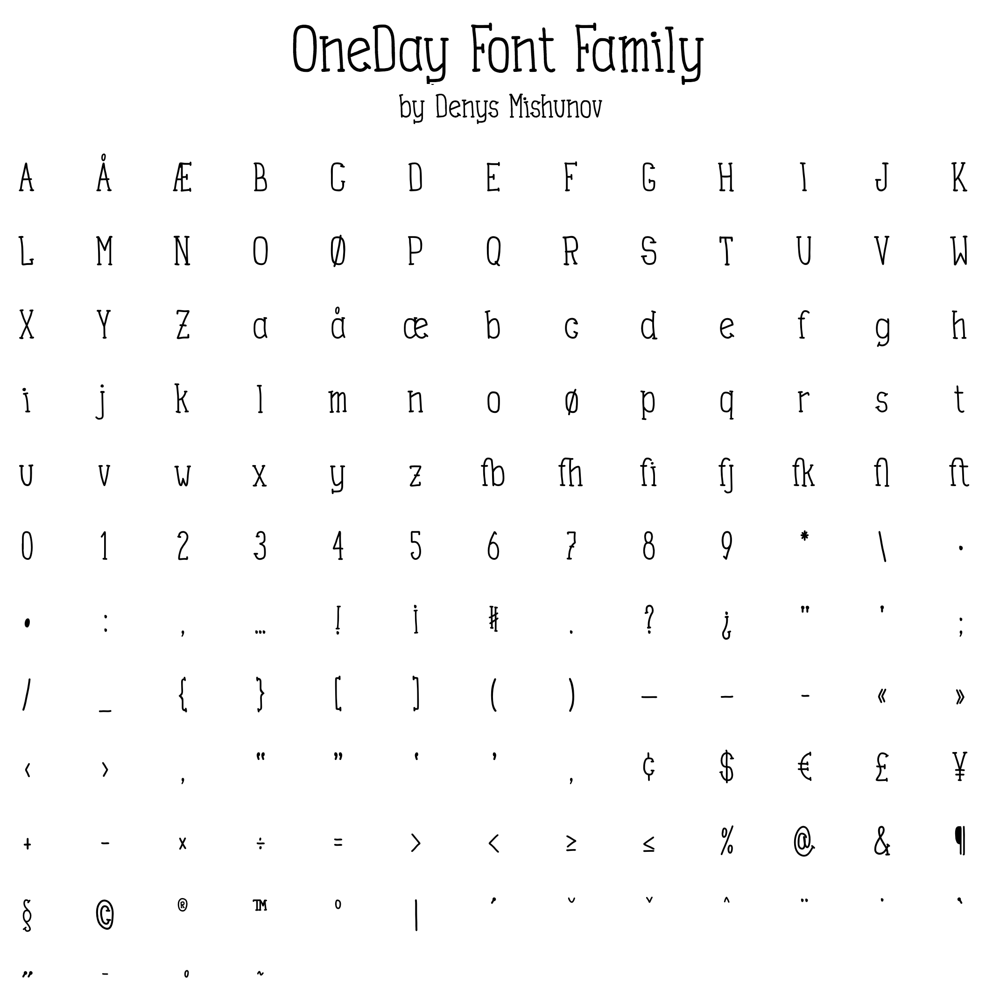

# Oneday

Oneday font family

The project is distributed under [SIL Open Font License v1.1](http://scripts.sil.org/OFL): feel free to fork, participate, submit pull requests.

The font is based on my own hand-writing style and originally has been intended to be used on my personal [web site](https://mishunov.me). The process of creation looked roughly like this:
  
  * hand-drawing on paper
  * hand-drawing in Adobe Sketch on iPad
  * importing all hand-drawn characters into Glyphs Mini
  * tuning the characters, kerning and ligatures (about 80% of all the work :-P)
  
Original idea was to create a wider font, but after all, the condensed version came out first. In the futire, the full family will contain regular width version and different weights for both versions. It is also supposed to be extended with Cyrillic characters.

## Repertoir

